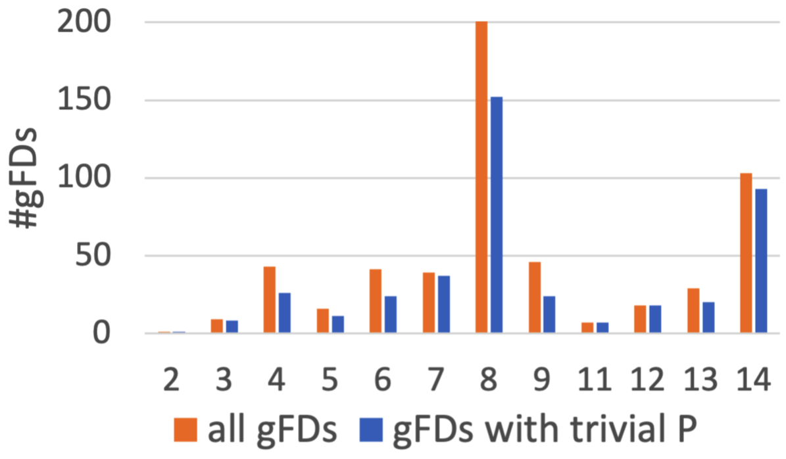

# What gFDs do graphs exhibit

To showcase the relevance of our research on the proposed graph-tailored functional dependencies and uniqueness constraints we performed a quantitative analysis of real world graph datasets by mining the gFDs that are satsified by the respective property graphs.

)

)
